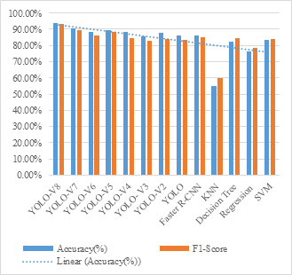

# Blindness detection api

**YOLOV8 based Diabetic Retinopathy recognition and classification**

The field of computer vision has made significant strides in the automatic screening of diabetic retinopathy (DR). This research area is well-established and focuses on overcoming challenges posed by the intricate structures and subtle contrast differences within retinal vessels and the background of fundus images. By leveraging advanced techniques, researchers are successfully developing solutions that can accurately detect and diagnose DR. Applying CLAHE to the green channel of an image with prominent bright lesions is a way to enhance the visibility of these lesions while managing the noise and contrast amplification. By performing this enhancement on just the green channel, we are focusing the enhancement on a
specific aspect of the image. Introducing an innovative approach to diabetic retinopathy screening, this work utilizes a cutting-edge technique that leverages asymmetric deep learning features. By employing SegNet for the precise classification of the optic nerve head and arteries, this method offers a promising solution in the field. By utilizing the approach, we can
effectively extract asymmetric deep learning features to precisely segment optic discs and blood vessels. This process sets the foundation for accurate diagnosis and treatment. To further enhance our capabilities, YOLOV8 algorithm is employed for classifying lesions related to diabetic retinopathy (DR). This advanced methodology ensures utmost precision and efficiency in addressing critical medical issues. The different types of lesions classified toward four distinct categories: Mild NPDR, Mod NPDR, PDR and Severe NPDR. This classification system helps in accurately identifying and understanding the nature of these injuries happened in retina which helps in providing the correct medication. To validate effectiveness of our proposed method, we conducted rigorous testing using two widely recognized retinal image datasets: APTOS and SDRD. This model is analysed and compared with various deep earning algorithms, in which AX-YOLOV8 achieves the maximum precision and accuracy of 93.19% and 93.6% respectively.

This research presents a novel and innovative approach to diabetic retinopathy (DR) screening, leveraging advanced techniques such as CLAHE, SegNet, and YOLOV8 algorithm. The application of CLAHE to the green channel effectively enhances the visibility of bright lesions while managing noise and contrast amplification, focusing the enhancement on a specific aspect of the image. The use of SegNet for the precise classification of the optic nerve head and arteries contributes to the accurate segmentation of these critical features, laying the foundation for precise diagnosis and treatment.

The incorporation of the YOLOV8 algorithm significantly improves the efficiency and precision of lesion classification, categorizing them into four distinct types: Mild NPDR, Mod NPDR, PDR, and Severe NPDR. This classification system aids in the identification and understanding of the nature of retinal injuries, facilitating the administration of correct medication. The comprehensive testing on widely recognized retinal image datasets, APTOS and SDRD, validates the effectiveness of our proposed method.

Notably, our model, AX-YOLOV8, achieves a maximum precision of 93.19% and accuracy of 93.6%, surpassing various deep learning algorithms. The success of our automated system in diagnosing diabetic retinopathy underscores the significance of integrating advanced technologies in addressing critical healthcare issues. The speed and precision advantages of YOLOV8, coupled with the nuanced features extracted by SegNet, contribute to the overall success of our methodology.

In essence, this work extends the frontier of automated DR screening, providing a robust and efficient solution for early detection and monitoring of microvascular issues associated with diabetic retinopathy. The findings emphasize the potential impact of combining advanced image processing techniques and deep learning algorithms in enhancing the accuracy and effectiveness of computer-aided diagnostic systems in the realm of ophthalmic healthcare.

 

Performance analysis of various deep learning models
